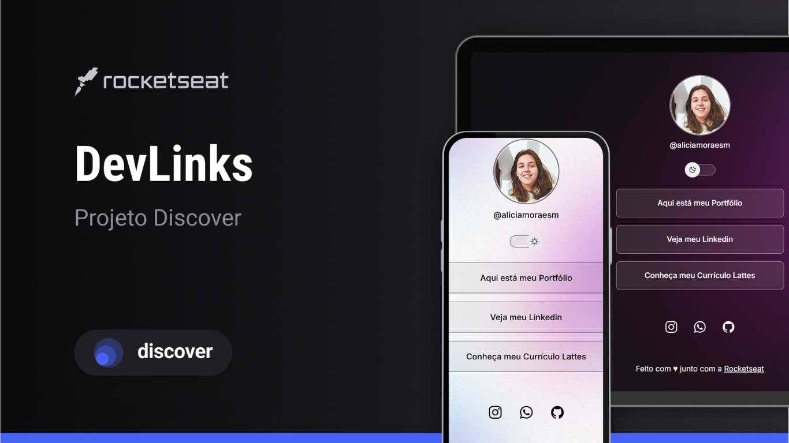

<h1 align="center"> DevLinks </h1>

Programa exclusivo e gratuito, promovido pela Rocketseat para ensino de tecnologias WEB.  

  <a href="#-tecnologias">Tecnologias</a>&nbsp;&nbsp;&nbsp;|&nbsp;&nbsp;&nbsp;
  <a href="#-projeto">Projeto</a>&nbsp;&nbsp;&nbsp;|&nbsp;&nbsp;&nbsp;
  <a href="#-layout">Layout</a>&nbsp;&nbsp;&nbsp;|&nbsp;&nbsp;&nbsp;
  <a href="#memo-licença">Licença</a>

  

 

## 🚀 Tecnologias

Esse projeto foi desenvolvido com as seguintes tecnologias:

<li> HTML
<li> CSS
<li> JavaScript
<li> Git and GitHub
<li> Figma

## 💻 Projeto

O DevLinks é um agregador de links para usar como cartão de visitas online.

[Visite o projeto online](https://app.rocketseat.com.br/journey/discover/contents) [Veja o meu projeto](https://aliciamoraesm.github.io/DevLinks/)

## 🔖 Layout

Você pode visualizar o layout do projeto através [DESSE LINK](https://www.figma.com/community/file/1187422022288947321). 
É necessário ter conta no [Figma](https://figma.com) para acessá-lo.

## :memo: Licença

Esse projeto está sob a licença MIT.

---
Feito com ♥ by Rocketseat e construído aqui neste repositório por ninguém menos que euzinha, Alicia!😁
 🚀[Participe da comunidade Rocketseat no DISCORD!](https://discord.gg/rocketseat)

    
<h4> Obrigado por visitar meu Git e se chegou até aqui dê um "FOLLOW" que retribuo, quem sabe não podemos colaborar em algum projeto juntos?
   
   

 Até a próxima! - Bye 😁🖖.

[def]: /preview.pn